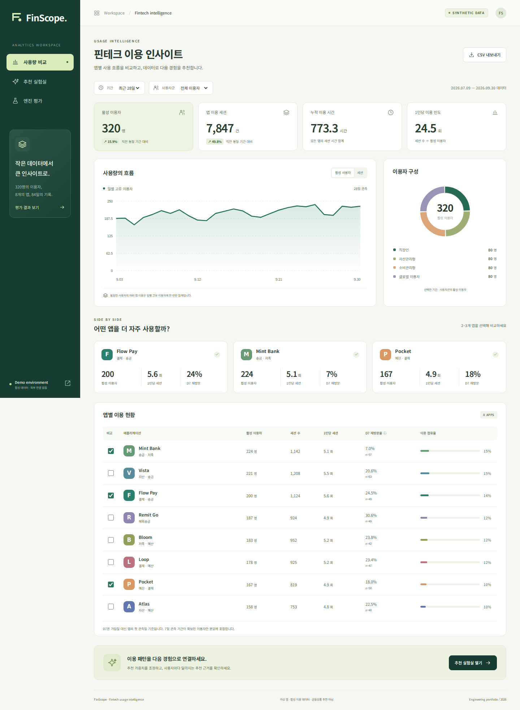
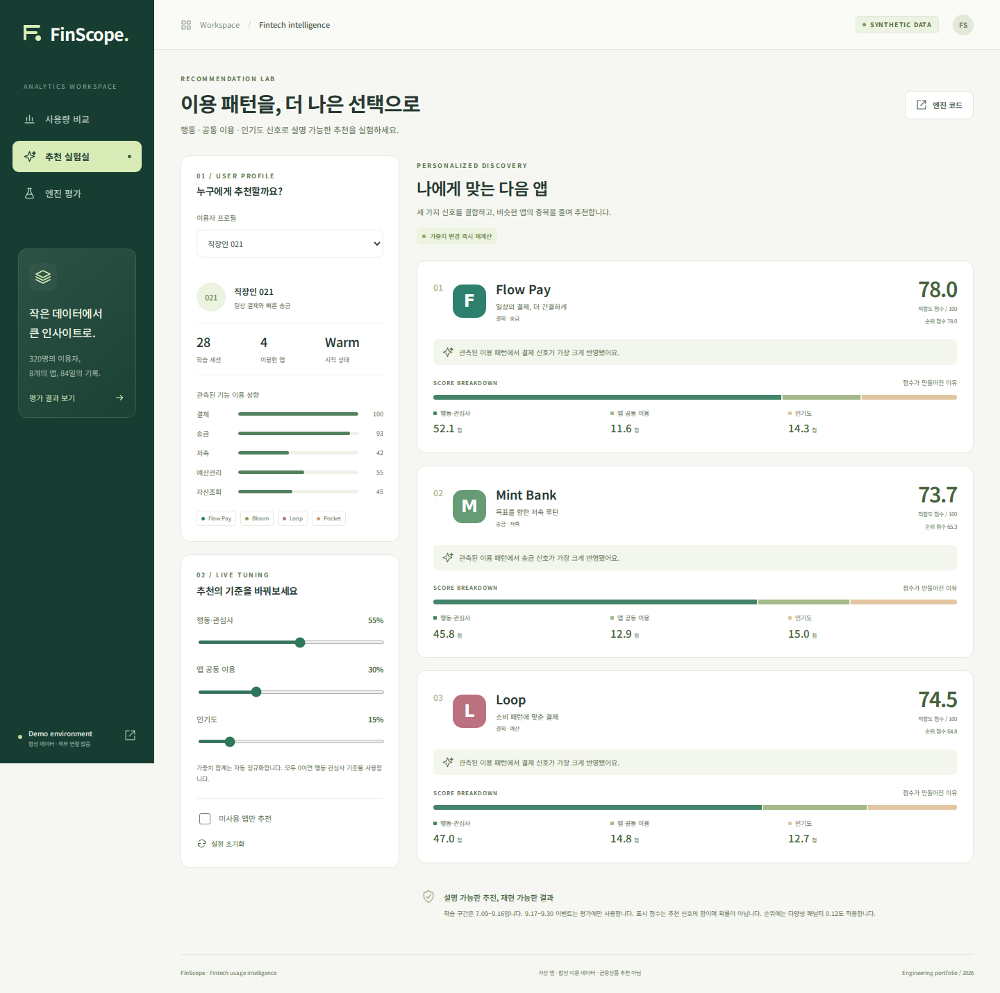
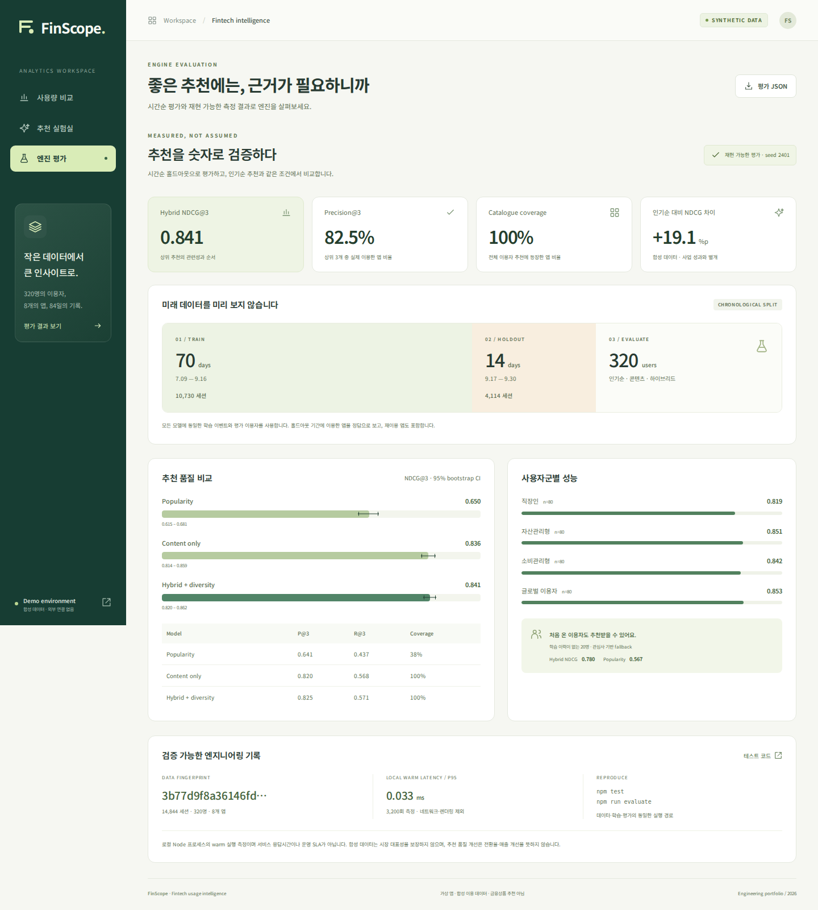
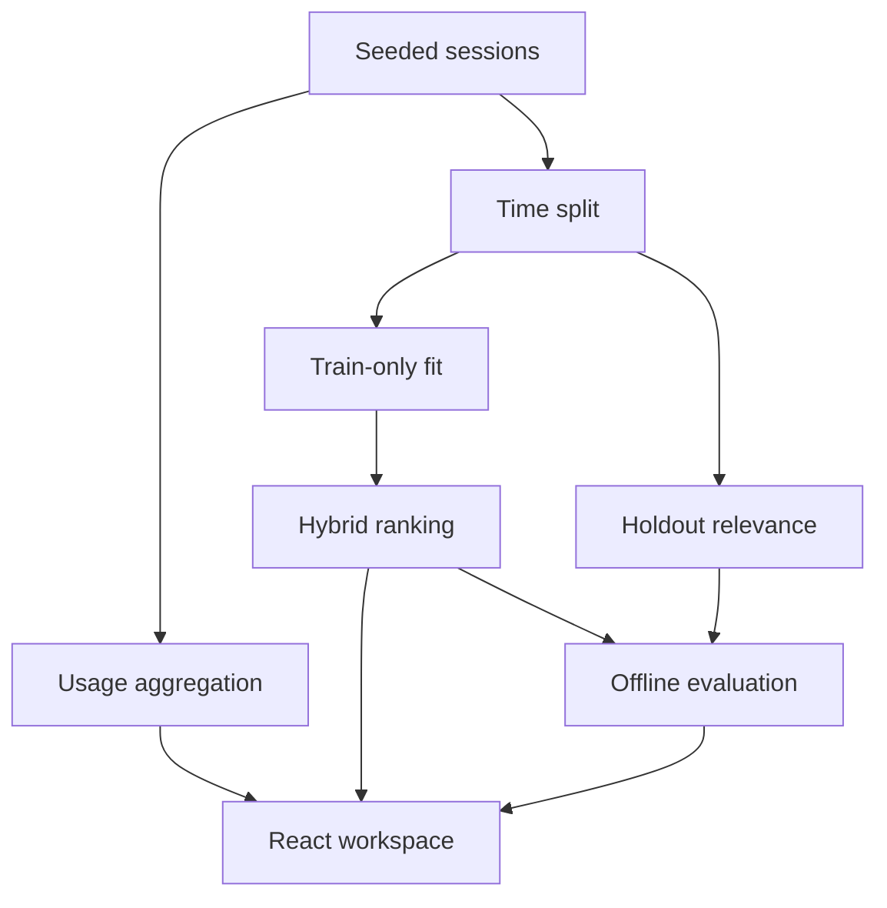

# FinScope · Fintech Usage & Recommendation Intelligence

**핀테크 앱 이용 데이터를 분석하고, 추천 순위가 만들어지는 이유까지 확인하는 인터랙티브 포트폴리오.**

[라이브 데모](https://seoyoung-finscope.onrender.com/) · [추천 엔진](src/domain/recommender.ts) · [측정 결과 JSON](public/reports/evaluation.json) · [검증 기록](docs/browser-verification.json) · [성공한 CI](https://github.com/seoyeonglee/fintech-usage-recommender/actions/runs/37001738868)



> 8개의 가상 앱 · 320명의 합성 이용자 · 84일 · **14,844개 실제 생성 세션**. 은행 계좌나 실제 고객 데이터를 연결하지 않습니다. 공개 URL의 배포 검증 상태는 [deployment.json](docs/deployment.json)에 기록합니다.

2026-10-02 공개 HTTPS 주소에서 필터·추천 가중치·미사용 앱 제외·평가 화면을 직접 확인했습니다. [실제 라이브 화면 캡처](docs/screenshots/live-verified.jpg)를 함께 보관합니다. 자동화된 14개 브라우저 시나리오는 로컬 및 GitHub Actions에서 통과했습니다.

## 90초 동안 확인할 수 있는 것

1. **사용량 비교:** 사용자군과 기간을 바꾸면 KPI·추이·앱별 현황이 함께 바뀝니다. 2–3개 앱을 선택해 비교하고 현재 집계를 CSV로 내려받을 수 있습니다.
2. **추천 실험실:** 익명 이용자 또는 신규 이용자를 선택하고, 행동·공동 이용·인기도 가중치를 변경하세요. 순위·점수·기여도가 즉시 재계산됩니다. ‘미사용 앱만’ 조건도 실제로 적용됩니다.
3. **엔진 평가:** 시간순 홀드아웃의 모델 비교, 95% bootstrap 구간, 사용자군/콜드스타트 결과, 데이터 지문을 확인하세요.

<table><tr><td width="50%"></td><td width="50%"></td></tr><tr><td>추천 기준과 점수 기여도를 직접 조정</td><td>동일한 홀드아웃으로 기준 모델과 비교</td></tr></table>

## 해결하려는 문제와 구현 범위

사용량의 총합만으로는 어떤 이용자에게 어떤 앱 경험이 적합한지 설명하기 어렵습니다. 이 프로젝트는 **이벤트 집계 → 사용자 성향 추출 → 앱 공동 이용 모델 → 설명 가능한 추천 → 시간순 평가**를 한 실행 경로로 연결합니다.

화면에만 존재하는 점수나 고정 차트가 아니라, Node 평가와 브라우저가 동일한 TypeScript 도메인 모듈을 실행합니다. 합성 데이터 생성기는 관심사와 앱 기능의 관계를 의도적으로 포함하므로, 평가값은 구현 검증용이며 실제 시장 성능의 증거가 아닙니다.

## 측정 결과

**2026-07-09–09-16 학습 / 09-17–09-30 평가 · K=3 · 320명.** 미래 이벤트는 모델 적합에 사용하지 않습니다. 평가 기간에 이용한 앱을 정답으로 보며, 이미 이용했던 앱도 정답에 포함합니다.

| 모델 | Precision@3 | Recall@3 | NDCG@3 | Catalogue coverage |
|---|---:|---:|---:|---:|
| Popularity | 0.641 | 0.437 | 0.650 | 37.5% |
| Content only | 0.820 | 0.568 | 0.836 | 100.0% |
| Hybrid + diversity | 0.825 | 0.571 | 0.841 | 100.0% |

- 평가 이벤트: **4,114건**, 학습 이벤트: **10,730건**.
- 콜드스타트 평가: **20명**, 학습 이력 없이 명시적 관심사 사용.
- 콘텐츠 단독 모델 대비 하이브리드의 추가 이득은 작습니다. 독립 실데이터나 유의성 검증 없이 실무 우위를 주장하지 않습니다.
- warm 로컬 추천 p95: **0.033ms**, 3,200회 측정. 네트워크·렌더링·동시 부하는 제외했으며 운영 SLA가 아닙니다.
- **18개 도메인·평가 테스트**와 브라우저 시나리오를 실행했습니다. 시드 재현성, D7 분모, 빈 데이터, 시간 분리, 제외 조건, 0/비정상 가중치, 설명 근거, 모바일·키보드·다운로드를 검증합니다.

[전체 평가 조건과 한계](docs/model-card.md) · [브라우저 검증 결과](docs/browser-verification.json)

## 설계



- **행동 신호:** 최근성 감쇠를 적용한 기능 이용 벡터와 앱 기능 벡터의 cosine similarity.
- **공동 이용 신호:** 앱별 이용자 집합의 cosine overlap을 기존 앱 이용 강도로 가중합니다.
- **인기도:** 학습 구간의 고유 이용자 수를 정규화합니다.
- **설명:** 정규화된 가중치 × 각 신호를 그대로 노출합니다. 근거 문구도 실제 최대 기여 신호에 맞춥니다.
- **다양성:** 선택한 앱과의 유사성에 패널티를 적용합니다. UI는 적합도와 다양성 반영 순위 점수를 구분합니다.

기본 가중치는 55/30/15, 다양성 패널티는 0.12입니다. 실험실에서 바꾼 값은 화면 실험용이고 커밋된 평가 결과를 바꾸지 않습니다.

## 실행과 재현

Node.js **22 이상**.

```bash
npm ci
npm test
npm run evaluate
npm run build
npm run test:browser
npm run dev
```

브라우저 검증을 새 환경에서 실행할 때는 먼저 `npx playwright install --with-deps chromium`을 실행하세요. 검증 스크립트는 빌드된 `dist`를 로컬에서 직접 서빙합니다. 공개 사이트 검증은 `DEMO_URL=https://seoyoung-finscope.onrender.com npm run test:browser`로 실행합니다.

`npm run evaluate`는 고정 시드의 데이터·학습·평가를 재생성합니다. 데이터 지문과 평가값은 재현 가능하며, 실행시간 값은 CPU·Node 버전에 따라 바뀝니다. GitHub Actions는 테스트·평가·프로덕션 빌드·브라우저 시나리오를 수행합니다.

## 코드 지도

| 경로 | 책임 |
|---|---|
| `src/domain/dataset.ts` | 시드 기반 세션 생성, 가입 시점 차이, 신규 사용자 |
| `src/domain/analytics.ts` | 기간/사용자군 필터, 고유 이용자, 첫 관측 D7 |
| `src/domain/recommender.ts` | 학습 전용 적합, 기여도, 제외 조건, 다양성 재정렬 |
| `src/domain/evaluation.ts` | 시간순 평가, 모델/사용자군 비교, bootstrap CI |
| `src/components/` | 집계·추천·평가 화면과 접근 가능한 차트 |
| `scripts/` | 평가 보고서 생성, 실제 브라우저 검증·화면 캡처 |
| `public/reports/` | 커밋된 평가 원본 |
| `docs/` | 아키텍처, 모델 한계, 운영 조건, 화면 캡처 |

## 엔지니어링 판단

- **브라우저 계산:** 8개 앱·320명 규모에서는 API와 DB 없이 완결된 기능을 빠르게 볼 수 있습니다. 수백만 이벤트 처리나 학습 인프라 구현을 주장하지 않습니다.
- **정적 배포:** cold start와 서버 비용을 줄입니다. 추천/집계는 접속자의 브라우저에서 실행합니다. 외부 API나 폰트 CDN을 호출하지 않습니다.
- **평가 분리:** 분석 화면은 전체 84일을 볼 수 있지만, 추천 모델은 앞 70일로 동결됩니다. UI의 기간 필터가 학습 경계를 바꾸지 않습니다.
- **D7 정의:** 실제 가입일을 알 수 없어 첫 관측일을 사용합니다. 정확히 7일 뒤 재방문한 비율이며 관측 기간이 충분한 사용자만 분모에 넣습니다.
- **운영 확장:** 실서비스에서는 동의 기반 수집, 이벤트 검증/중복 제거, 집계 저장소, 별도 학습·서빙, 노출 로그 기반 A/B 평가가 필요합니다. [확장 설계](docs/architecture.md)에 경계와 선택 이유를 정리했습니다.

## 다른 포트폴리오와의 역할 구분

`audit-evidence-agent`가 증빙·통제 판단·추적성을 다룬다면, FinScope는 **고객 행동 데이터와 추천 제품의 설계·구현·평가**를 보여줍니다. 기존 금융·보안 도메인 경험을 제품 분석과 개인화 엔진으로 확장한 별도 프로젝트입니다.

## 배포·비용 조건

Render Static Site에 `dist`만 배포합니다. 유료 웹 서버, DB, AI API, 도메인을 생성하지 않습니다. 자동 배포는 꺼두고 검증된 변경만 수동 배포합니다. 정적 사이트도 워크스페이스의 대역폭·빌드 사용량 한도에 합산되므로 **영구적인 무제한 0원은 보장하지 않습니다**. 카드 등록이나 유료 플랜 변경은 수행하지 않습니다. [운영·무료 범위 조건](docs/operations.md)

배포 후 Dashboard가 로그인 화면으로 연결되어 결제수단 및 사용량 초과 과금 차단 설정은 확인하지 못했습니다. 서비스 자체는 무료 정적 사이트이며, 계정 수준의 과금 방지 설정은 별도 확인이 필요합니다.

MIT · Noto Sans KR는 SIL Open Font License로 번들링하며 [글꼴 라이선스](docs/font-license.txt)를 포함합니다.
